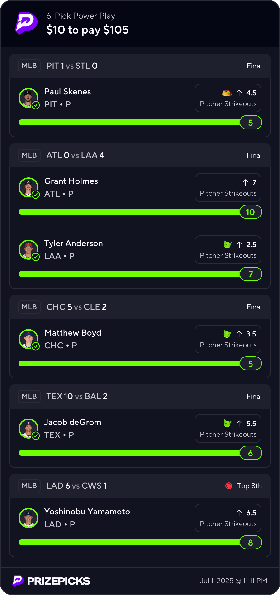
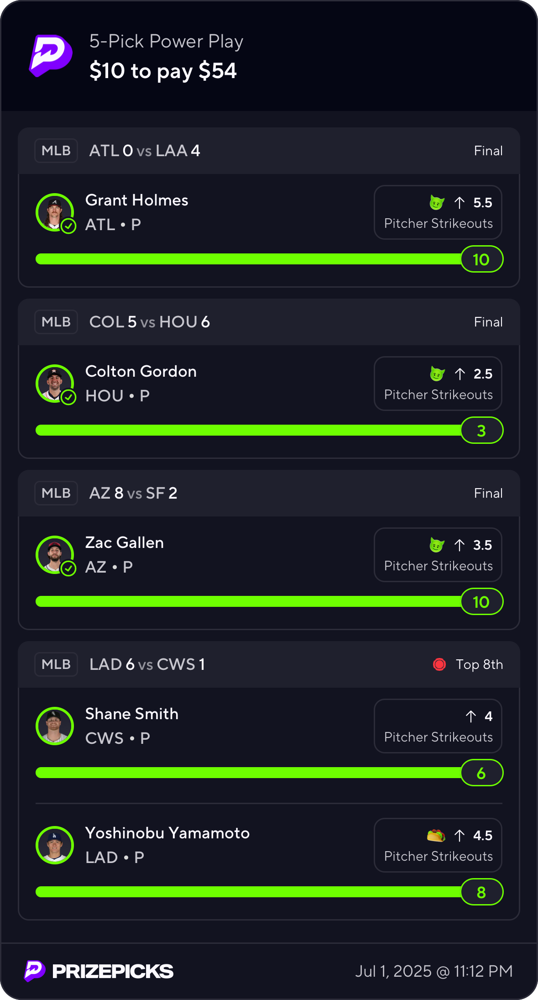

# mlb-prop-finder

# Overview
This repository is used to predict PrizePicks pitcher props (Strikeouts, Fantasy Score, Earned Runs). Right now because it is an initial implementation, it will only attempt to predict Strikeouts.

---

## The Three Best_Line Predictors

### 1. Best Line Predictor 1 (Just Statistics)
This predictor combines betting odds from DraftKings and Underdog to identify the most favorable strikeout prop bets. It compares the PrizePicks line with lines and odds from these sportsbooks, calculates the edge based on implied probabilities derived from the odds, and ranks the plays that show the greatest statistical edge. Essentially, it picks the best betting signals by weighing the agreement and odds from multiple sportsbooks.

### 2. Best Line Predictor 2 (Statistics + Historical Stats)
This predictor leverages historical pitching data combined with betting odds to identify edges. It loads the daily slate of pitchers and normalizes player names for consistency. Using a custom function, it converts betting odds into implied probabilities and averages them across sportsbooks. It calculates how close DraftKings and Underdog lines are to PrizePicks lines, checks for consistency (within a tolerance), and picks the strongest bets based on the highest edge — the difference between implied probability and a neutral 50%. This predictor essentially merges statistical insights and betting market signals to pick value plays.

Key steps:
- Load today’s slate of pitcher props.
- Normalize player names.
- Convert odds to probabilities.
- Calculate differences between lines from DraftKings, Underdog, and PrizePicks.
- Pick the best bet direction (OVER/UNDER) based on odds and edge.
- Output the top 5 picks ranked by highest edge.

### 3. Best Line Predictor 3 (XGBoost Model- Machine Learning)
The third predictor is a machine learning model (XGBoost) trained on historical pitching performance and other relevant features. Instead of relying purely on market odds, this model predicts the expected strikeouts for each pitcher based on features that have been decided in the pitcher_data_exploration.ipynb file. It then compares these model-predicted strikeout totals against the PrizePicks lines to determine the best picks (OVER or UNDER) and calculates the edge as the difference between predicted strikeouts and the betting line.

---

## Summary Table

| Predictor               | Methodology                            | Input Data                                       | Output                                      | File Location                                  |
|-------------------------|----------------------------------------|--------------------------------------------------|---------------------------------------------|------------------------------------------------|
| **1: Odds Aggregator**  | Combines sportsbook odds to find edges | DraftKings & Underdog betting odds & lines       | Top 5 bets by best odds edge                  | `best_lines/best_lines_{current_date}.csv`             |
| **2: Historical + Odds**| Uses historical stats + odds to calculate edge | Daily slate + normalized names + odds    | Top 5 picks ranked by edge                  | `best_lines/best_lines_{current_date}.csv`             |
| **3: XGBoost Model**    | ML model predicts strikeouts vs. PP line | Historical pitching stats + advanced metrics     | Model-based strikeout predictions & picks   | `best_lines_ml/mlb_preds_history.csv`          |

---

Right now, the 3rd method(XGBoost) is by far the best. It has around a 66% hit rate on props for the past 2 days that I didn't upload to this repo. At the time of updating this ReadMe, I uploaded the first prediction slate for the ML model in the best_lines_ml folder to see how good it will perform

Already received a 10$ limit on PrizePicks for discounted projections. Up a few hundred dollars currently, I will update this for big wins as I continue to test and improve the model.

  <strong>July 1st, 2025</strong>
    
  

